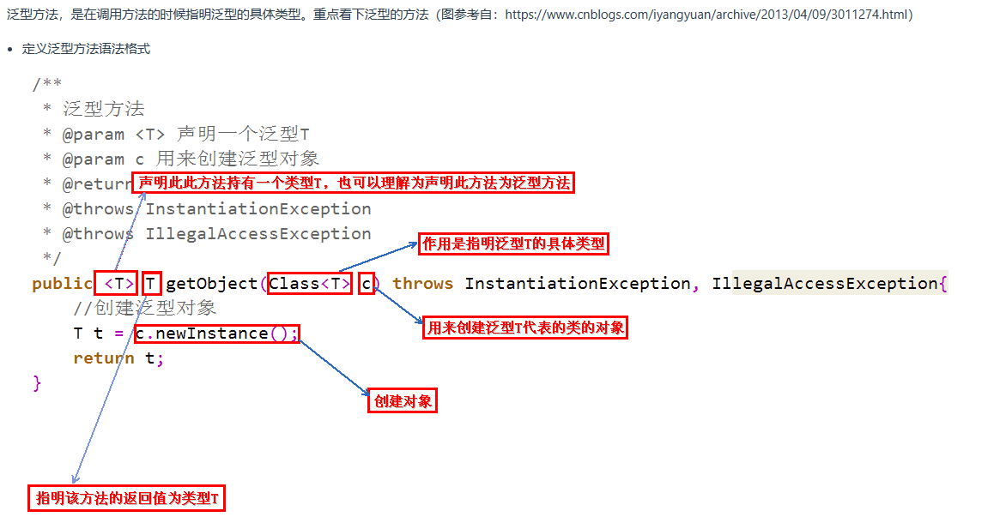
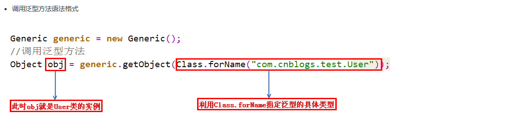
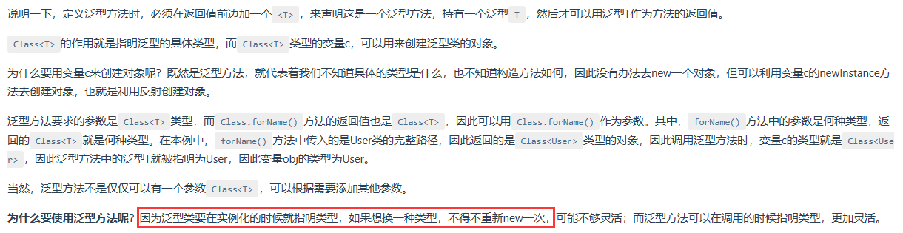
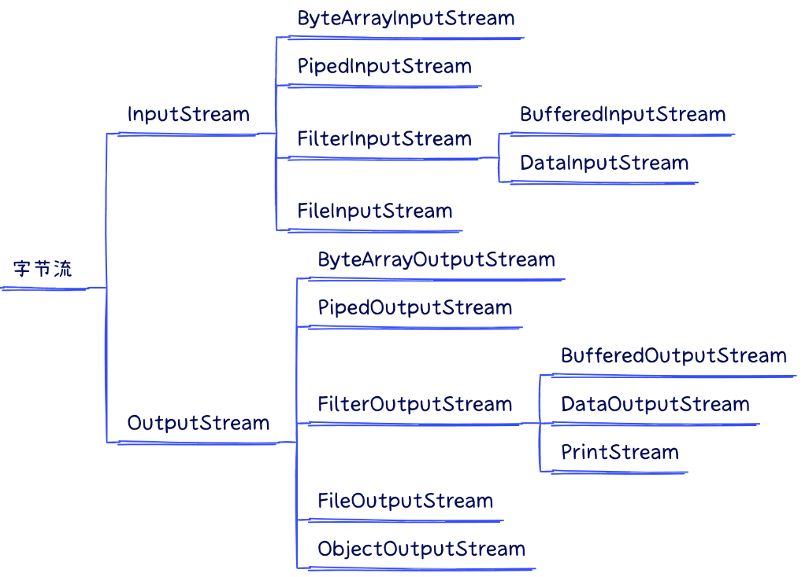
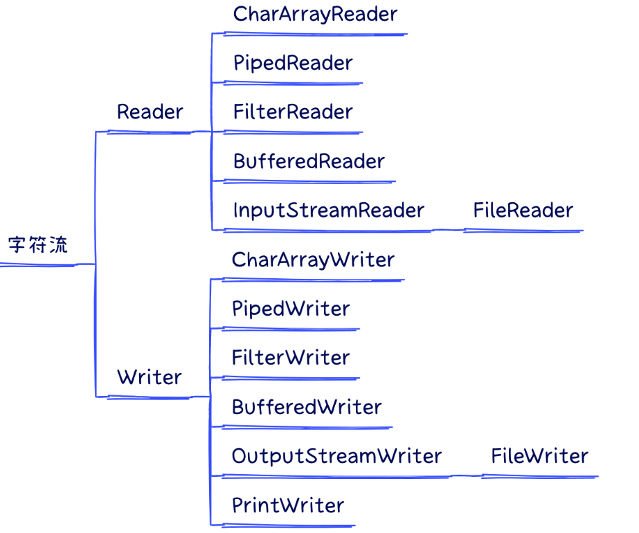

# 记录Java的学习历程
## 2023/08/13
学习了Java的相关基础：变量、运算符、输入输出、循环结构、分支结构、一部分数组的知识，发现虽然之前多学过但是都忘了，很多东西第二次再看的时候确实有和之前不同的感受！希望继续加油！坚持下去！

## 2023/08/14
学习了数组的相关基础知识，再次学习了冒泡排序、快速排序以及二分查找的相关原理和代码
### 冒泡排序：每经过一轮都可以选出一个最大值
```java
public static int[] bubble_Sort(int[] nums){
        boolean flag = true;  //假设数组已经是有序的
        for (int i = 0; i < nums.length; i++){
            for (int j = 0; j < nums.length - i - 1; j++) {
                if (nums[j] > nums[j+1]){
                    int temp = nums[j+1];
                    nums[j+1] = nums[j];
                    nums[j] = temp;
                    //如果数组发生了交换，说明数组还没有排好序
                    flag = false;
                }
            }
            if (flag) {
                break;
            }
        }
        return nums;
    }
```
### 快速排序
```java
public static void quickSort(int[] data) {
		subSort(data, 0, data.length - 1);
	}

	private static void subSort(int[] data, int start, int end) {
		if (start < end) {
			int base = data[start];
			int low = start;
			int high = end + 1;

			while (true) {
				//找出比base小的low 从前往后找
			    while (low < end && data[++low] <= base);
				//找出比base打的high  从后往前找
				while (high > start && data[--high] >= base);
				if (low < high) {
					//交换data数组[low]与[high]位置的元素
					swap(data, low, high);
				}else {
				    break;
				}
			}


			//交换data数组[start]与[high]位置的元素
			swap(data, start, high);

			//经过代码[start, high)部分的元素 比[high, end]都要小

			//通过递归调用，对data数组[start, high-1]部分的元素重复刚才的过程
			subSort(data, start, high - 1);
			//通过递归调用，对data数组[high+1,end]部分的元素重复刚才的过程
			subSort(data, high + 1, end);
		}
	}

	private static void swap(int[] data, int i, int j) {
		int temp = data[i];
		data[i] = data[j];
		data[j] = temp;
	}
```
### 二分查找
```java
while (left <= right){
     int mid = (left + right) / 2;
     if (arr[mid] > num){
         right = mid - 1;
     }else if (arr[mid] < num) {
         left = mid + 1;
     }else if (arr[mid] == num){
         index = mid;
         break;
     }
}
```

## 2023/08/15
今天学习了Java中的面向对象（基础）的相关知识，包括方法的重载、可变个数形参，值传递和引用传递，递归方法。由于之前都学过，所以进度要快很多，代码量比较大，但基本上都是一些机械式的代码。这些都是一些基础，需要逐步的去夯实。

## 2023/08/16
今天实验室停电，所以学习进度有些落下了。晚上来点后才过来学习了Java基础中面向对象的三大要素，封装、继承、多态。同时更加加深了对重载(overload)和重写(override/overwrite)的认识。
#### 重载（Overload）
+ 定义：重载是指在同一个类中，可以有多个具有相同名称但参数列表不同的方法。
+ 特点：重载方法必须具有不同的参数类型、参数数量或参数顺序，但方法名必须相同。
+ 作用：通过重载，可以根据不同的参数类型或数量来执行不同的操作，提高代码的灵活性和可读性。
#### 重写（Override / Overwrite）：
+ 定义：重写是指在子类中重新定义（覆盖）从父类继承而来的方法，以改变其行为。
+ 特点：重写方法必须具有相同的方法名、参数列表和返回类型。
+ 作用：通过重写，可以根据子类的特定需求修改父类的方法实现，实现多态性和特定行为的定制。

以及对super的重新认识，以前在学到这里的时候没有很在意，后面到学JavaWeb的时候遇到规模比较复杂的问题是，需要调用super就感觉有些蒙了。
> 3.1 super调用属性、方法
子类继承父类以后，我们就可以在子类的方法或构造器中，调用父类中声明的属性或方法。（满足封装性的前提下）
如何调用呢？需要使用"super."的结构，表示调用父类的属性或方法。
一般情况下，我们可以考虑省略"super."的结构。但是，**如果出现子类重写了父类的方法或子父类中出现了同名的属性时，
则必须使用"super."的声明**，显式的调用父类被重写的方法或父类中声明的同名的属性。

> 3.2 super调用构造器
① 子类继承父类时，不会继承父类的构造器。只能通过“super(形参列表)”的方式调用父类指定的构造器。
② 规定：“super(形参列表)”，必须声明在构造器的首行。
③ 我们前面讲过，在构造器的首行可以使用"this(形参列表)"，调用本类中重载的构造器，
结合②，结论：在构造器的首行，"this(形参列表)" 和 "super(形参列表)"只能二选一。
④ 如果在子类构造器的首行既没有显示调用"this(形参列表)"，也没有显式调用"super(形参列表)"，
则子类此构造器默认调用"super()"，即调用父类中空参的构造器。
⑤ 由③和④得到结论：子类的任何一个构造器中，要么会调用本类中重载的构造器，要么会调用父类的构造器。
只能是这两种情况之一。
⑥ 由⑤得到：一个类中声明有n个构造器，最多有n-1个构造器中使用了"this(形参列表)"，
则剩下的那个一定使用"super(形参列表)"。

#### 成员变量不具有多态性
```java
class Base {
    int count = 10;
    public void display() {
        System.out.println(this.count);
    }
}

class Sub extends Base {
    int count = 20;
    public void display() {
        System.out.println(this.count); //这个 this.count 就是表示的是当前的Sub下的count值
    }
}

public class FieldMethodTest {
    public static void main(String[] args){
        Sub s = new Sub();
        System.out.println(s.count);// 20
        s.display();// 20
        Base b = s;  //多态 调用的还是 s 中的 display()
        System.out.println(b == s); // true  相当于将 s 的地址值直接赋值给了 b
        /*
        * 在这段代码中，b 是一个 Base 类型的引用，指向一个 Sub 类的对象。当通过 b 访问成员变量 count 时，由于成员变量不具有多态性，
        * 所以访问的是引用类型 Base 的成员变量 count，而不是对象类型 Sub 的成员变量。
        * */
        System.out.println(b.count);// 10
        b.display();// 20

        Base b1 = new Base();
        System.out.println(b1.count); // 10
        b1.display();// 10
    }
}
```

#### 面试题： 区分 == 和 equals()
对于字符串变量来说，使用"=="和"equals"比较字符串时，其比较方法不同。"=="比较两个变量本身的值，即两个对象在内存中的首地址，"equals"比较字符串包含内容是否相同。

对于非字符串变量来说，如果没有对equals()进行重写的话，"==" 和 "equals"方法的作用是相同的，都是用来比较对象在堆内存中的首地址，即用来比较两个引用变量是否指向同一个对象。

#### 面试题：final 、 finally 、 finalize 的区别
final 可以用来修饰：类、方法、变量和参数，其中可以用来修饰“参数”这一项，容易被人遗忘，这是 final 的 4 种用法。
##### final 用法说明
+ 当 final 修饰类时，此类不允许被继承，表示此类设计的很完美，不需要被修改和扩展。
+ 当 final 修饰方法时，此方法不允许任何从此类继承的类来重写此方法，表示此方法提供的功能已经满足当前要求，不需要进行扩展。
+ 当 final 修饰变量时，表示该变量一旦被初始化便不可以被修改。
+ 当 final 修饰参数时，表示此参数在整个方法内不允许被修改。

finally 则是 Java 中保证重点代码一定要被执行的一种机制。
我们可以使用 try-finally 或者 try-catch-finally 来进行类似关闭 JDBC 连接、保证释放锁等动作。
##### finally 用法
```java
try {
    // do something
} finally {
    // 一定会执行的代码
}
```
有时候面试也会问：finally 是否一定会被执行？这是一个有诱导嫌疑的问题，正常情况下 finally 一定是会执行的，但有一个特殊情况 finally 也是不会执行的，特殊的实现代码和执行结果如下：
```java
public class FinallyExample {
    public static void main(String[] args) {
        try {
            System.out.println("执行try代码. ");
            System.exit(0);
        }finally {
            System.out.println("执行finally. ");
        }
    }
}
```

finalize 是 Object 类中的一个基础方法，它的设计目的是保证对象在被垃圾收集前完成特定资源的回收，但在 JDK 9 中已经被标记为弃用的方法（deprecated）。

在实际开发中不推荐使用 finalize 方法，它虽然被创造出来，但无法保证 finalize 方法一定会被执行，所以不要依赖它释放任何资源，因为它的执行极不“稳定”。在 JDK 9 中将它废弃，也很好的证明了此观点。
finalize 除了执行“不稳定”之外，还有一定的性能问题。 ​

因为 finalize 的执行是和垃圾收集关联在一起的，一旦实现了非空的 finalize 方法，就会导致相应对象回收呈现数量级上的变慢，有人专门做过 benchmark，大概是 40~50 倍的下降。 ​

因为 finalize 被设计成在对象被垃圾收集前调用，这就意味着实现了 finalize 方法的对象是个“特殊公民”，JVM 要对它进行额外处理。finalize 本质上成为了快速回收的阻碍者，可能导致你的对象经过多个垃圾收集周期才能被回收。

##### 总结
>final、finally 和 finalize 从英文字面角度来看，看似很像，实则 3 者在 Java 中没任何关系。
final 是用来修饰类、方法、变量和参数的关键字，被 final 修饰的对象不允许修改或替换其原始值或定义；
finally 是 Java 中保证重点代码一定要被执行的一种机制；
finalize 是 Object 类中的一个基础方法，它的设计目的是保证对象在被垃圾收集前完成特定资源的回收的，但其执行“不稳定”，且有一定的性能问题，已经在 JDK 9 中被设置为弃用的方法了。


## 2023/08/17
今天还是学习面向对象的知识，不过这个课程比之前看的课程要好一些。今天还再次学习了设计模式中的单例模式。面向对象的知识点已经啃完了，感觉Java的内容是真的多啊，而且有些还比较杂，真的感觉需要沉下心来慢慢啃，好好学。可惜时不我待，现在不仅需要赶进度也要保证自己真的学进去了，还是挺费力的。真的非常痛恨自己之前为啥不早一些准备，不过抱怨也是没有任何作用的，还是好好珍惜眼下的时间吧，好好学习。
### 单例模式
所谓类的单例设计模式，就是采取一定的方法保证在整个的软件系统中，**对某个类只能存在一个对象实例**，**并且该类只提供一个取得其对象实例的方法**。
```java
//饿汉式
class Bank{
    //1.类的构造器私有化
    private Bank() {

    }

    //2.在类的内部创建当前类的实例
    //4.此属性也必须声明为static的
    private static Bank instance = new Bank();

    //3.使用getXxx()方法获取当前类的实例，必须声明为static的
    public static Bank getInstance() {
        return instance;
    }
}
```
```java
//懒汉式
class Bank{
    //1.类的构造器私有化
    private Bank() {

    }

    //2.在类的内部创建当前类的实例
    //4.此属性也必须声明为static的
    private static Bank instance = null;

    //3.通过getXxx()获得当前类的实例，如果未创建对象，则在方法内部进行创建
    public static GirlFriend getInstance() {
        if (instance == null) {
            instance = new GirlFriend();
        }
        return instance;
    }
}
```
特点：
> 饿汉式：“立即加载”,随着类的加载，当前的唯一实例就创建了
> 
> 懒汉式："延迟加载",在需要使用的时候，进行创建。

优缺点：
> 饿汉式：（优点）写法简单，由于内存中较早加载，使用更方便、更快。是线程安全的。 （缺点）内存中占用时间较长。
> 
> 懒汉式：（缺点）线程不安全 （放到多线程章节时解决）（优点）在需要的时候进行创建，节省内存空间。

### IDEA的操作
```text
第1组：通用型
说明             快捷键
--------------------------------
复制代码-copy     ctrl + c
粘贴-paste       ctrl + v
剪切-cut         ctrl + x
撤销-undo        ctrl + z
反撤销-redo      ctrl + shift + z
保存-save all    ctrl + s
全选-select all  ctrl + a


第2组：提高编写速度（上）
说明                                                快捷键
-------------------------------------------------------------------
智能提示-edit                                       alt + enter
提示代码模板-insert live template                    ctrl+j
使用xx块环绕-surround with ...                      ctrl+alt+t
调出生成getter/setter/构造器等结构-generate ...       alt+insert
自动生成返回值变量-introduce variable ...             ctrl+alt+v
复制指定行的代码-duplicate line or selection          ctrl+d
删除指定行的代码-delete line                          ctrl+y
切换到下一行代码空位-start new line                   shift + enter
切换到上一行代码空位-start new line before current    ctrl +alt+ enter
向上移动代码-move statement up                       ctrl+shift+↑
向下移动代码-move statement down                     ctrl+shift+↓
向上移动一行-move line up                            alt+shift+↑
向下移动一行-move line down                          alt+shift+↓
方法的形参列表提醒-parameter info                     ctrl+p


第3组：提高编写速度（下）
说明                                         快捷键
---------------------------------------------------------
批量修改指定的变量名、方法名、类名等-rename        shift+f6
抽取代码重构方法-extract method ...            ctrl+alt+m
重写父类的方法-override methods ...            ctrl+o
实现接口的方法-implements methods ...          ctrl+i
选中的结构的大小写的切换-toggle case             ctrl+shift+u
批量导包-optimize imports                     ctrl+alt+o


第4组：类结构、查找和查看源码
说明                                                      快捷键
-----------------------------------------------------------------------------------------
如何查看源码-go to class...                             ctrl + 选中指定的结构 或 ctrl+n
显示当前类结构，支持搜索指定的方法、属性等-file structure     ctrl+f12
退回到前一个编辑的页面-back                               ctrl+alt+←
进入到下一个编辑的页面-forward                            ctrl+alt+→
打开的类文件之间切换-select previous/next tab             alt+←/→
光标选中指定的类，查看继承树结构-Type Hierarchy             ctrl+h
查看方法文档-quick documentation                        ctrl+q
类的UML关系图-show uml popup                            ctrl+alt+u
定位某行-go to line/column                              ctrl+g
回溯变量或方法的来源-go to implementation(s)              ctrl+alt+b
折叠方法实现-collapse all                                ctrl+shift+ -
展开方法实现-expand all                                  ctrl+shift+ +


第5组：查找、替换与关闭
说明                                               快捷键
--------------------------------------------------------------
查找指定的结构                                       ctrl+f
快速查找：选中的Word快速定位到下一个-find next           ctrl+l
查找与替换-replace                                   ctrl+r
直接定位到当前行的首位-move caret to line start        home
直接定位到当前行的末位 -move caret to line end         end
查询当前元素在当前文件中的引用，然后按 F3 可以选择          ctrl+f7
全项目搜索文本-find in path ...                      ctrl+shift+f


第6组：调整格式
说明                                          快捷键
--------------------------------------------------------------
格式化代码-reformat code                        ctrl+alt+l
使用单行注释-comment with line comment          ctrl + /
使用/取消多行注释-comment with block comment     ctrl + shift + /
选中数行，整体往后移动-tab                        tab
选中数行，整体往前移动-prev tab                   shift + tab
```

## 2023/08/18
今天打算学习异常和多线程以及常用的api
### 异常
```text
开发中，如何选择异常处理的两种方式？(重要、经验之谈)
- 如果程序代码中，涉及到资源的调用（流、数据库连接、网络连接等），则必须考虑使用try-catch-finally来处理，
  保证不出现内存泄漏。
- 如果父类被重写的方法没有throws异常类型，则子类重写的方法中如果出现异常，只能考虑使用try-catch-finally
  进行处理，不能throws。
- 开发中，方法a中依次调用了方法b,c,d等方法，方法b,c,d之间是递进关系。此时，如果方法b,c,d中有异常，
  我们通常选择使用throws，而方法a中通常选择使用try-catch-finally。
```
### 多线程
程序(program)：为完成特定任务，用某种语言编写的`一组指令的集合`。即指一段静态的代码。

进程(process)：程序的一次执行过程，或是正在内存中运行的应用程序。程序是静态的，进程是动态的。
进程作为操作系统调度和分配资源的最小单位。

线程(thread)：进程可进一步细化为线程，是程序内部的一条执行路径。
线程作为CPU调度和执行的最小单位

线程创建的两种方式：
```text
1. 线程的创建方式一：
步骤：
① 创建一个继承于Thread类的子类
② 重写Thread类的run() --->将此线程要执行的操作，声明在此方法体中
③ 创建当前Thread的子类的对象
④ 通过对象调用start(): 1.启动线程 2.调用当前线程的run()
```

```text
2. 线程的创建方式二：实现Runnable接口
步骤：
① 创建一个实现Runnable接口的类
② 实现接口中的run() -->将此线程要执行的操作，声明在此方法体中
③ 创建当前实现类的对象
④ 将此对象作为参数传递到Thread类的构造器中，创建Thread类的实例
⑤ Thread类的实例调用start():1.启动线程 2.调用当前线程的run()
```
```text
对比两种方式？
共同点：① 启动线程，使用的都是Thread类中定义的start()
② 创建的线程对象，都是Thread类或其子类的实例。

不同点：一个是类的继承，一个是接口的实现。
建议：建议使用实现Runnable接口的方式。
Runnable方式的好处：
① 实现的方式，避免的类的单继承的局限性
② 更适合处理有共享数据的问题。
③ 实现了代码和数据的分离。
```
今天感觉学习很没有状态，首先是起的比较晚，昨天晚上听小说听上头了，以至于今天中午才醒。醒来后到实验室才发现今天的任务完不成了，所以一味的赶进度赶进度，真的感觉心越浮躁越赶进度，就学的越慢，越学不进去。以后还是要早点睡，进度虽然重要，但也要保证质量，要真正的学进去了，而不是走马观花。那就既浪费了时间，又没有学到东西。得不尝试啊！得不尝试啊！

## 2023/08/19
### 线程安全 --- 使用线程的同步机制
```java
synchronized (SaleTicket.class) { // 结构：Class clz = SaleTicket.class，是唯一的。
   if (ticket > 0 ) {

      try {
         Thread.sleep(10);
      } catch (InterruptedException e) {
         e.printStackTrace();
      }

      System.out.println(Thread.currentThread().getName() + "售票，票号为：" + ticket);
      ticket--;
   }
}
```
#### lock
```java
class Window extends Thread{
    static int ticket = 100;

    //1.创建Lock的实例，需要确保多个线程共用同一个Lock实例!需要考虑将此对象声明为static final
    private static final ReentrantLock lock = new ReentrantLock();

    @Override
    public void run() {
        while (true) {
            try {
                //2.执行lock()方法，锁定对共享资源的调用
                lock.lock();
                if (ticket > 0){

                    try {
                        Thread.sleep(100);
                    } catch (InterruptedException e) {
                        e.printStackTrace();
                    }

                    System.out.println(Thread.currentThread().getName() + "售票，票号为：" + ticket);
                    ticket--;
                }else {
                    break;
                }
            } finally {
                //3.unlock()的调用，释放对共享数据的锁定
                lock.unlock();
            }
        }
    }
}
```
#### 创建多线程的方式三：实现Callable
```java
//1.创建一个实现Callable的实现类
class NumThread implements Callable {
    //2.实现call方法，将此线程需要执行的操作声明在call()中
    @Override
    public Object call() throws Exception {
        int sum = 0;
        for (int i = 1; i <= 100; i++) {
            if (i % 2 == 0) {
                System.out.println(i);
                sum += i;
            }
//            Thread.sleep(1000);
        }
        return sum;
    }
}


public class CallableTest {
    public static void main(String[] args) {
        //3.创建Callable接口实现类的对象
        NumThread numThread = new NumThread();

        //4.将此Callable接口实现类的对象作为传递到FutureTask构造器中，创建FutureTask的对象
        FutureTask futureTask = new FutureTask(numThread);

        //5.将FutureTask的对象作为参数传递到Thread类的构造器中，创建Thread对象，并调用start()
        Thread t1 = new Thread(futureTask);
        t1.start();


//      接收返回值
        try {
            //6.获取Callable中call方法的返回值
            //get()返回值即为FutureTask构造器参数Callable实现类重写的call()的返回值。
            Object sum = futureTask.get();
            System.out.println("总和为：" + sum);
        } catch (InterruptedException e) {
            e.printStackTrace();
        } catch (ExecutionException e) {
            e.printStackTrace();
        }
    }

}
```

#### 创建并使用多线程的第四种方法：使用线程池
```java
class NumberThread implements Runnable{

    @Override
    public void run() {
        for(int i = 0;i <= 100;i++){
            if(i % 2 == 0){
                System.out.println(Thread.currentThread().getName() + ": " + i);
            }
        }
    }
}

class NumberThread1 implements Runnable{

    @Override
    public void run() {
        for(int i = 0;i <= 100;i++){
            if(i % 2 != 0){
                System.out.println(Thread.currentThread().getName() + ": " + i);
            }
        }
    }
}

public class ThreadPool {

    public static void main(String[] args) {
        //1. 提供指定线程数量的线程池
        ExecutorService service = Executors.newFixedThreadPool(10);
        ThreadPoolExecutor service1 = (ThreadPoolExecutor) service;
//        //设置线程池的属性
//        System.out.println(service.getClass());//ThreadPoolExecutor
        service1.setMaximumPoolSize(50); //设置线程池中线程数的上限

        //2.执行指定的线程的操作。需要提供实现Runnable接口或Callable接口实现类的对象
        service.execute(new NumberThread());//适合适用于Runnable
        service.execute(new NumberThread1());//适合适用于Runnable

//        service.submit(Callable callable);//适合使用于Callable
        //3.关闭连接池
        service.shutdown();
    }

}
```
```text
1. 三个类的对比:String、StringBuffer、StringBuilder
> String:不可变的字符序列;底层使用char[] （jdk8及之前），底层使用byte[] （jdk9及之后）
> StringBuffer:可变的字符序列;JDK1.0声明，线程安全的，效率低;底层使用char[] （jdk8及之前），底层使用byte[] （jdk9及之后）
> StringBuilder:可变的字符序列;JDK5.0声明，线程不安全的,效率高;底层使用char[] （jdk8及之前），底层使用byte[] （jdk9及之后）

2. StringBuffer/StringBuilder的可变性分析（源码分析）：
回顾：
String s1 = new String(); //char[] value = new char[0];
String s2 = new String("abc");// char[] value = new char[]{'a','b','c'};

针对于StringBuilder来说：
内部的属性有：
    char[] value; //存储字符序列
    int count; //实际存储的字符的个数

StringBuilder sBuffer1 = new StringBuilder();//char[] value = new char[16];
StringBuilder sBuffer1 = new StringBuilder("abc"); //char[] value = new char[16 + "abc".length()];

sBuffer1.append("ac");//value[0] = 'a'; value[1] = 'c';
sBuffer1.append("b");//value[2] = 'b';

...不断的添加，一旦count要超过value.length时，就需要扩容：默认扩容为原有容量的2倍+2。
并将原有value数组中的元素复制到新的数组中。


3. 源码启示：
> 如果开发中需要频繁的针对于字符串进行增、删、改等操作，建议使用StringBuffer或StringBuilder替换String.
  因为使用String效率低。
> 如果开发中，不涉及到线程安全问题，建议使用StringBuilder替换StringBuffer。因为使用StringBuilder效率高
> 如果开发中大体确定要操作的字符的个数，建议使用带int capacity参数的构造器。因为可以避免底层多次扩容操作，性能更高。


4. StringBuffer和StringBuilder中的常用方法
增：
    append(xx)
删：
    delete(int start, int end)
    deleteCharAt(int index)
改：
    replace(int start, int end, String str)
    setCharAt(int index, char c)
查：
    charAt(int index)
插：
    insert(int index, xx)
长度：
    length()

5. 对比三者的执行效率
效率从高到低排列：
StringBuilder > StringBuffer > String
```

## 2023/08/20
今天学习了Java中一些集合框架，ArrayList、Vector、LinkList等

**ArrayList、Vector的区别？ ArrayList、LinkedList的区别？**
```text
ArrayList和Vector是Java集合框架中的两个类，它们都实现了List接口，但在一些方面有一些区别。

ArrayList和Vector的区别：

线程安全性：ArrayList是非线程安全的，而Vector是线程安全的。Vector的方法都是同步的，适用于多线程环境下的并发访问。而ArrayList没有同步机制，适用于单线程环境下的高效访问。

扩容：ArrayList和Vector都是动态数组，可以根据需要自动扩容。但是，它们的扩容机制略有不同。ArrayList每次扩容时，将当前容量增加一半，而Vector则默认增加当前容量的一倍。这可能会导致Vector的扩容代价更高。

性能：由于Vector是线程安全的，它在执行访问和修改操作时需要进行同步处理，这可能会带来一些额外的性能开销。相比之下，ArrayList在单线程环境下通常具有更好的性能。

ArrayList和LinkedList的区别：

底层数据结构：ArrayList是基于动态数组实现的，而LinkedList是基于双向链表实现的。这导致它们在内存分配、插入和删除操作上具有不同的性能特点。

访问效率：ArrayList支持随机访问，可以通过索引快速访问元素。而LinkedList的访问效率较低，需要从头或尾部开始遍历链表找到指定位置的元素。

插入和删除操作：在插入和删除元素方面，LinkedList相对更高效。在链表中插入或删除元素只需调整相邻节点的指针，时间复杂度为O(1)。而ArrayList在中间位置插入或删除元素时，需要将后续元素整体向后或向前移动，时间复杂度为O(n)。

空间占用：由于LinkedList需要存储额外的指针来构建链表，相对于ArrayList来说，它会占用更多的内存空间。
```

```text
面试题：区分Collection 和 Collections
Collection：集合框架中的用于存储一个一个元素的接口，又分为List和Set等子接口。
Collections：用于操作集合框架的一个工具类。此时的集合框架包括：Set、List、Map
```
###泛型方法




## 2023/08/21
今天学习了ArrayList和LinkList的源码，以及IO分类。
#### 字节流


#### 字符流


##### 字节流和字符流的区别
+ 字节流读取单个字节，字符流读取单个字符(一个字符根据编码的不同，对应的字节也不同，如 UTF-8 编码中文汉字是 3 个字节，GBK编码中文汉字是 2 个字节。)
+ 字节流用来处理二进制文件(图片、MP3、视频文件)，字符流用来处理文本文件(可以看做是特殊的二进制文件，使用了某种编码，人可以阅读)。

> 简而言之，字节是给计算机看的，字符是给人看的

